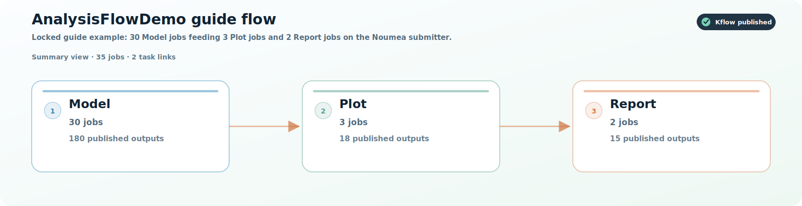

# AnalysisFlowDemo guide flow

[](manifest.json)

> Locked guide example: 30 Model jobs feeding 3 Plot jobs and 2 Report jobs on the Noumea submitter.

**Package contents:** flow chart, node folders, output bundle, checksums, and local/Kflow rerun instructions.

## Flow chart

The summary SVG below is suitable for reports or appendices. Open `flow.html` locally for a browsable version, or use the node table below to jump into each folder.



- [Download or embed the summary SVG](flow-summary.svg)
- [Download the detailed job SVG](flow.svg)
- [Open the HTML flow view](flow.html)
- [See the Mermaid source](flow.mmd)

## Restore the saved outputs

`make` downloads the GitHub Release asset, extracts it into the node folders, verifies checksums, and prints the saved run summary.

```bash
make
```

No `make` installed? Use one of these:

```bash
python reproduce.py
./reproduce.sh
```

```powershell
.\reproduce.ps1
```

For private repositories or private release assets, set `GITHUB_TOKEN` or `GH_TOKEN` before restoring outputs.

## Run locally without Kflow

The package includes a standalone runner. It reads `manifest.json`, clones each recorded source repository, checks out the saved commit, wires dependency outputs through `INPUT_DIR`, and writes fresh outputs to `rerun-work/outputs/<node-slug>` and `nodes/<node-slug>/outputs`.

List available nodes:

```bash
python reproduce.py list-nodes
```

Run the whole flow from the beginning:

```bash
make run-local
# or
KFLOW_ALLOW_RERUN=1 python reproduce.py run-local
```

Run one node and all upstream dependencies needed for that node:

```bash
make run-node NODE=<node-slug-or-number>
# or
KFLOW_ALLOW_RERUN=1 python reproduce.py run-node <node-slug-or-number>
```

Run only the selected node, assuming dependency outputs already exist from `make restore` or a previous rerun:

```bash
KFLOW_ALLOW_RERUN=1 python reproduce.py run-node <node-slug-or-number> --no-deps
```

If the original jobs used a Docker image, install Docker and run with `KFLOW_USE_DOCKER=1`. Otherwise the recorded command runs directly on your local machine and needs the same tools, packages, credentials, and data access as the original analysis.

## Reproduce from Kflow

Open Kflow's Reproduce tab, paste this GitHub folder URL or `manifest.json` URL, and choose Import and rerun. Kflow creates fresh tasks from this manifest and preserves locked tasks as isolated records.

## Recreate the run plan

`make rerun-plan` shows the original source folders, commits, commands, input links, and public job config values from the saved run. `make rerun-local` is a best-effort local replay for machines that already have the required software and data.

## Output bundle

- [Download full output bundle](https://github.com/kyuhank/AnalysisFlowDemo/releases/download/kflow-flow-398592774392/kflow-flow-398592774392-outputs.tar.gz)

## Source map

| Task | Source repo | Ref | Folder | Nodes |
| --- | --- | --- | --- | ---: |
| Model | [kyuhank/AnalysisFlowDemo](https://github.com/kyuhank/AnalysisFlowDemo/tree/20057f1df3799442821edf9a325c2a94d4b196df/model) | `20057f1` | `model` | 30 |
| Plot | [kyuhank/AnalysisFlowDemo](https://github.com/kyuhank/AnalysisFlowDemo/tree/20057f1df3799442821edf9a325c2a94d4b196df/plot) | `20057f1` | `plot` | 3 |
| Report | [kyuhank/AnalysisFlowDemo](https://github.com/kyuhank/AnalysisFlowDemo/tree/20057f1df3799442821edf9a325c2a94d4b196df/report) | `20057f1` | `report` | 2 |

## Package structure

```text
.
├── README.md
├── manifest.json
├── flow-summary.svg
├── flow.html
├── rerun-plan.md
├── reproduce.py
└── nodes/
    ├── Model/ 30 nodes: model-01, model-02, model-03, model-04, ... +26 more
    ├── Plot/ 3 nodes: plot-a-10, plot-b-15, plot-c-5
    ├── Report/ 2 nodes: report-a-b, report-c
```

## Nodes by task

<details open>
<summary><strong>Model</strong> · 30 nodes · <code>model</code> @ <code>20057f1</code></summary>

- [Model 1: model-01](nodes/model-01/) · `model-01` · completed · 6 outputs
- [Model 2: model-02](nodes/model-02/) · `model-02` · completed · 6 outputs
- [Model 3: model-03](nodes/model-03/) · `model-03` · completed · 6 outputs
- [Model 4: model-04](nodes/model-04/) · `model-04` · completed · 6 outputs
- [Model 5: model-05](nodes/model-05/) · `model-05` · completed · 6 outputs
- [Model 6: model-06](nodes/model-06/) · `model-06` · completed · 6 outputs
- [Model 7: model-07](nodes/model-07/) · `model-07` · completed · 6 outputs
- [Model 8: model-08](nodes/model-08/) · `model-08` · completed · 6 outputs
- [Model 9: model-09](nodes/model-09/) · `model-09` · completed · 6 outputs
- [Model 10: model-10](nodes/model-10/) · `model-10` · completed · 6 outputs
- [Model 11: model-11](nodes/model-11/) · `model-11` · completed · 6 outputs
- [Model 12: model-12](nodes/model-12/) · `model-12` · completed · 6 outputs
- [Model 13: model-13](nodes/model-13/) · `model-13` · completed · 6 outputs
- [Model 14: model-14](nodes/model-14/) · `model-14` · completed · 6 outputs
- [Model 15: model-15](nodes/model-15/) · `model-15` · completed · 6 outputs
- [Model 16: model-16](nodes/model-16/) · `model-16` · completed · 6 outputs
- [Model 17: model-17](nodes/model-17/) · `model-17` · completed · 6 outputs
- [Model 18: model-18](nodes/model-18/) · `model-18` · completed · 6 outputs
- [Model 19: model-19](nodes/model-19/) · `model-19` · completed · 6 outputs
- [Model 20: model-20](nodes/model-20/) · `model-20` · completed · 6 outputs
- [Model 21: model-21](nodes/model-21/) · `model-21` · completed · 6 outputs
- [Model 22: model-22](nodes/model-22/) · `model-22` · completed · 6 outputs
- [Model 23: model-23](nodes/model-23/) · `model-23` · completed · 6 outputs
- [Model 24: model-24](nodes/model-24/) · `model-24` · completed · 6 outputs
- [Model 25: model-25](nodes/model-25/) · `model-25` · completed · 6 outputs
- [Model 26: model-26](nodes/model-26/) · `model-26` · completed · 6 outputs
- [Model 27: model-27](nodes/model-27/) · `model-27` · completed · 6 outputs
- [Model 28: model-28](nodes/model-28/) · `model-28` · completed · 6 outputs
- [Model 29: model-29](nodes/model-29/) · `model-29` · completed · 6 outputs
- [Model 30: model-30](nodes/model-30/) · `model-30` · completed · 6 outputs

</details>

<details open>
<summary><strong>Plot</strong> · 3 nodes · <code>plot</code> @ <code>20057f1</code></summary>

- [Plot bundle A](nodes/plot-a-10/) · `plot-a-10` · completed · 6 outputs
- [Plot bundle B](nodes/plot-b-15/) · `plot-b-15` · completed · 6 outputs
- [Plot bundle C](nodes/plot-c-5/) · `plot-c-5` · completed · 6 outputs

</details>

<details open>
<summary><strong>Report</strong> · 2 nodes · <code>report</code> @ <code>20057f1</code></summary>

- [Report: bundles A+B](nodes/report-a-b/) · `report-a-b` · completed · 8 outputs
- [Report: bundle C](nodes/report-c/) · `report-c` · completed · 7 outputs

</details>
