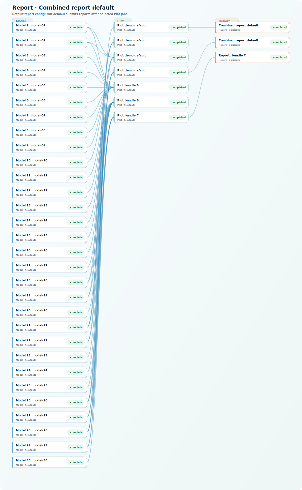

# Report · Combined report default

A published Kflow reproducibility package: flow chart, node folders, output bundle, checksums, and rerun notes.

Default report config; run-demo.R submits reports after selected Plot jobs.

## Flow chart

The SVG below is suitable for reports or appendices. Open `flow.html` locally for a browsable version, or use the node table below to jump into each folder.



- [Download or embed the SVG](flow.svg)
- [Open the HTML flow view](flow.html)
- [See the Mermaid source](flow.mmd)

## Restore the saved outputs

`make` downloads the GitHub Release asset, extracts it into the node folders, verifies checksums, and prints the saved run summary.

```bash
make
```

No `make` installed? Use one of these:

```bash
python reproduce.py
./reproduce.sh
```

```powershell
.\reproduce.ps1
```

For private repositories or private release assets, set `GITHUB_TOKEN` or `GH_TOKEN` before restoring outputs.

## Recreate the run

`make rerun-plan` shows the original source folders, commits, commands, input links, and public job config values from the saved run. `make rerun-local` is a best-effort local replay for machines that already have the required software and data.

## Output bundle

- [Download full output bundle](https://github.com/kyuhank/AnalysisFlowDemo/releases/download/kflow-flow-da59c4949540-public-smoke-20260613-031758/kflow-flow-da59c4949540-public-smoke-20260613-031758-outputs.tar.gz)

## Nodes

| Task | Node | Status | Outputs | Source |
| --- | --- | --- | ---: | --- |
| Model | [Model 1: model-01](nodes/model-model-01/) | completed | 6 | [source](https://github.com/kyuhank/AnalysisFlowDemo/tree/91913d964fcfee8de3a9549166031079bbc973e6/model) |
| Model | [Model 2: model-02](nodes/model-model-02/) | completed | 6 | [source](https://github.com/kyuhank/AnalysisFlowDemo/tree/91913d964fcfee8de3a9549166031079bbc973e6/model) |
| Model | [Model 3: model-03](nodes/model-model-03/) | completed | 6 | [source](https://github.com/kyuhank/AnalysisFlowDemo/tree/91913d964fcfee8de3a9549166031079bbc973e6/model) |
| Model | [Model 4: model-04](nodes/model-model-04/) | completed | 6 | [source](https://github.com/kyuhank/AnalysisFlowDemo/tree/91913d964fcfee8de3a9549166031079bbc973e6/model) |
| Model | [Model 5: model-05](nodes/model-model-05/) | completed | 6 | [source](https://github.com/kyuhank/AnalysisFlowDemo/tree/91913d964fcfee8de3a9549166031079bbc973e6/model) |
| Model | [Model 6: model-06](nodes/model-model-06/) | completed | 6 | [source](https://github.com/kyuhank/AnalysisFlowDemo/tree/91913d964fcfee8de3a9549166031079bbc973e6/model) |
| Model | [Model 7: model-07](nodes/model-model-07/) | completed | 6 | [source](https://github.com/kyuhank/AnalysisFlowDemo/tree/91913d964fcfee8de3a9549166031079bbc973e6/model) |
| Model | [Model 8: model-08](nodes/model-model-08/) | completed | 6 | [source](https://github.com/kyuhank/AnalysisFlowDemo/tree/91913d964fcfee8de3a9549166031079bbc973e6/model) |
| Model | [Model 9: model-09](nodes/model-model-09/) | completed | 6 | [source](https://github.com/kyuhank/AnalysisFlowDemo/tree/91913d964fcfee8de3a9549166031079bbc973e6/model) |
| Model | [Model 10: model-10](nodes/model-model-10/) | completed | 6 | [source](https://github.com/kyuhank/AnalysisFlowDemo/tree/91913d964fcfee8de3a9549166031079bbc973e6/model) |
| Model | [Model 11: model-11](nodes/model-model-11/) | completed | 6 | [source](https://github.com/kyuhank/AnalysisFlowDemo/tree/91913d964fcfee8de3a9549166031079bbc973e6/model) |
| Model | [Model 12: model-12](nodes/model-model-12/) | completed | 6 | [source](https://github.com/kyuhank/AnalysisFlowDemo/tree/91913d964fcfee8de3a9549166031079bbc973e6/model) |
| Model | [Model 13: model-13](nodes/model-model-13/) | completed | 6 | [source](https://github.com/kyuhank/AnalysisFlowDemo/tree/91913d964fcfee8de3a9549166031079bbc973e6/model) |
| Model | [Model 14: model-14](nodes/model-model-14/) | completed | 6 | [source](https://github.com/kyuhank/AnalysisFlowDemo/tree/91913d964fcfee8de3a9549166031079bbc973e6/model) |
| Model | [Model 15: model-15](nodes/model-model-15/) | completed | 6 | [source](https://github.com/kyuhank/AnalysisFlowDemo/tree/91913d964fcfee8de3a9549166031079bbc973e6/model) |
| Model | [Model 16: model-16](nodes/model-model-16/) | completed | 6 | [source](https://github.com/kyuhank/AnalysisFlowDemo/tree/91913d964fcfee8de3a9549166031079bbc973e6/model) |
| Model | [Model 17: model-17](nodes/model-model-17/) | completed | 6 | [source](https://github.com/kyuhank/AnalysisFlowDemo/tree/91913d964fcfee8de3a9549166031079bbc973e6/model) |
| Model | [Model 18: model-18](nodes/model-model-18/) | completed | 6 | [source](https://github.com/kyuhank/AnalysisFlowDemo/tree/91913d964fcfee8de3a9549166031079bbc973e6/model) |
| Model | [Model 19: model-19](nodes/model-model-19/) | completed | 6 | [source](https://github.com/kyuhank/AnalysisFlowDemo/tree/91913d964fcfee8de3a9549166031079bbc973e6/model) |
| Model | [Model 20: model-20](nodes/model-model-20/) | completed | 6 | [source](https://github.com/kyuhank/AnalysisFlowDemo/tree/91913d964fcfee8de3a9549166031079bbc973e6/model) |
| Model | [Model 21: model-21](nodes/model-model-21/) | completed | 6 | [source](https://github.com/kyuhank/AnalysisFlowDemo/tree/91913d964fcfee8de3a9549166031079bbc973e6/model) |
| Model | [Model 22: model-22](nodes/model-model-22/) | completed | 6 | [source](https://github.com/kyuhank/AnalysisFlowDemo/tree/91913d964fcfee8de3a9549166031079bbc973e6/model) |
| Model | [Model 23: model-23](nodes/model-model-23/) | completed | 6 | [source](https://github.com/kyuhank/AnalysisFlowDemo/tree/91913d964fcfee8de3a9549166031079bbc973e6/model) |
| Model | [Model 24: model-24](nodes/model-model-24/) | completed | 6 | [source](https://github.com/kyuhank/AnalysisFlowDemo/tree/91913d964fcfee8de3a9549166031079bbc973e6/model) |
| Model | [Model 25: model-25](nodes/model-model-25/) | completed | 6 | [source](https://github.com/kyuhank/AnalysisFlowDemo/tree/91913d964fcfee8de3a9549166031079bbc973e6/model) |
| Model | [Model 26: model-26](nodes/model-model-26/) | completed | 6 | [source](https://github.com/kyuhank/AnalysisFlowDemo/tree/91913d964fcfee8de3a9549166031079bbc973e6/model) |
| Model | [Model 27: model-27](nodes/model-model-27/) | completed | 6 | [source](https://github.com/kyuhank/AnalysisFlowDemo/tree/91913d964fcfee8de3a9549166031079bbc973e6/model) |
| Model | [Model 28: model-28](nodes/model-model-28/) | completed | 6 | [source](https://github.com/kyuhank/AnalysisFlowDemo/tree/91913d964fcfee8de3a9549166031079bbc973e6/model) |
| Model | [Model 29: model-29](nodes/model-model-29/) | completed | 6 | [source](https://github.com/kyuhank/AnalysisFlowDemo/tree/91913d964fcfee8de3a9549166031079bbc973e6/model) |
| Model | [Model 30: model-30](nodes/model-model-30/) | completed | 6 | [source](https://github.com/kyuhank/AnalysisFlowDemo/tree/91913d964fcfee8de3a9549166031079bbc973e6/model) |
| Plot | [Plot demo default](nodes/plot-job-5/) | completed | 6 | [source](https://github.com/kyuhank/AnalysisFlowDemo/tree/9457ea109480fb6c4c64aea203075ef6d72e92df/plot) |
| Plot | [Plot demo default](nodes/plot-job-8/) | completed | 6 | [source](https://github.com/kyuhank/AnalysisFlowDemo/tree/9457ea109480fb6c4c64aea203075ef6d72e92df/plot) |
| Plot | [Plot demo default](nodes/plot-job-11/) | completed | 6 | [source](https://github.com/kyuhank/AnalysisFlowDemo/tree/9457ea109480fb6c4c64aea203075ef6d72e92df/plot) |
| Plot | [Plot demo default](nodes/plot-job-13/) | completed | 6 | [source](https://github.com/kyuhank/AnalysisFlowDemo/tree/9457ea109480fb6c4c64aea203075ef6d72e92df/plot) |
| Plot | [Plot bundle A](nodes/plot-plot-a-10/) | completed | 6 | [source](https://github.com/kyuhank/AnalysisFlowDemo/tree/91913d964fcfee8de3a9549166031079bbc973e6/plot) |
| Plot | [Plot bundle B](nodes/plot-plot-b-15/) | completed | 6 | [source](https://github.com/kyuhank/AnalysisFlowDemo/tree/91913d964fcfee8de3a9549166031079bbc973e6/plot) |
| Plot | [Plot bundle C](nodes/plot-plot-c-5/) | completed | 6 | [source](https://github.com/kyuhank/AnalysisFlowDemo/tree/91913d964fcfee8de3a9549166031079bbc973e6/plot) |
| Report | [Combined report default](nodes/report-job-4/) | completed | 7 | [source](https://github.com/kyuhank/AnalysisFlowDemo/tree/9457ea109480fb6c4c64aea203075ef6d72e92df/report) |
| Report | [Combined report default](nodes/report-job-12/) | completed | 7 | [source](https://github.com/kyuhank/AnalysisFlowDemo/tree/9457ea109480fb6c4c64aea203075ef6d72e92df/report) |
| Report | [Report: bundle C](nodes/report-report-c/) | completed | 7 | [source](https://github.com/kyuhank/AnalysisFlowDemo/tree/91913d964fcfee8de3a9549166031079bbc973e6/report) |
